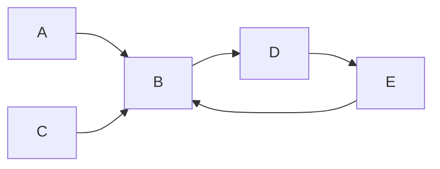

# 题目内容

链接：[POJ1094](https://vjudge.net/problem/POJ-1094)

# 算法详解

## Kahn算法

摘抄维基百科上对于Kahn算法的伪代码描述：

```
L← Empty list that will contain the sorted elements
S ← Set of all nodes with no incoming edges
while S is non-empty do
    remove a node n from S
    insert n into L
    foreach node m with an edge e from nto m do
        remove edge e from thegraph
        ifm has no other incoming edges then
            insert m into S
if graph has edges then
    return error (graph has at least onecycle)
else 
    return L (a topologically sortedorder)
```

其实概要一下，几句话就可以了：

1. 寻找入度为0的点。
2. 如果有多个，说明无法排序
3. 如果没有入度为0的点，且图中有节点，说明有环
4. 如果有一个入度为0的点，把这个点排到队伍后面，然后把图中这个点去掉 
5. 图中什么都没有的时候结束运算，不然就循环到1。

# 题解
该题作为拓扑排序实现的经典题，在lrj的《算法竞赛入门经典（第二版）》中P167有原题。书中使用了DFS作为拓扑排序的方法，但是个人觉得利用DFS进行拓扑排序无论从算法效率和编码难度上都存在问题。
于是采用了根据当前无入度点检索进行排序的方法，编码难度瞬间下降。算法详见算法详解。

# 编码注意点

## 注意char，int类型转换

```C++
#define getid(letter) (letter - 'A')
#define getletter(id) (char)(id + 'A')
```

## 无法排序的时候依旧要继续执行

在topsort函数中有这么一行：

```c++
// 这里不return因为不知道后面存不存在环 
if(zeroNum > 1) 	flag = 0; // uncertain 
if(zeroNum == 0)	return -1; // 有环 
```

原本我的实现如下，在发现有多个入度为0（无法确定排序）的时候退出算法：

```c++
// 这里不return因为不知道后面存不存在环 
if(zeroNum > 1) 	return  0; // uncertain 
if(zeroNum == 0)	return -1; // 有环 
```

这个编码获得了OJ上W的结果。原因在于，虽然这时候可以肯定这个序列是无法确定排序的，但是万一后面几个点存在环的时候呢？以下图为例进行说明：



图中A，C为入度为0的点，如果直接返回0的话，会忽略对后面BED环的检测工作，于是原本应该输出**Inconsistency found after %d relations.** 的结果，却只能输出 **Sorted sequence cannot be determined.**

所以当发现存在多个入度为0的点的时候，依旧要继续检测后面的节点，检测是否存在环。

# 源代码
```C++
#include<iostream>
#include<cstring>
#include<cstdio>
using namespace std;

#define maxn 30
#define rep(i,n) for(int i = 0;i < n;i++)
#define getid(letter) (letter - 'A')
#define getletter(id) (char)(id + 'A')

// the definition of graph
int G[maxn][maxn];
// the indegree of node
int indeg[maxn];
// sorted array
char s[maxn];
// N -> node num
// M -> edge num
int N,M;


// ret: 0 -> uncertain -1 -> inconsistency 1 -> ok
int topsort(){
	
	int in[maxn];
	s[N] = '\0';
	int flag = 1;
	
	// copy indeg 
	rep(i,N){
		in[i] = indeg[i];
	}

	rep(i,N){
		int zeroNum = 0;
		int zeroPos = -1;
		// find indegree zero
		rep(j,N){
			if(in[j] == 0){
				zeroPos = j;
				zeroNum++;
			}
		} 
		// 这里不return因为不知道后面存不存在环 
		if(zeroNum > 1) 	flag = 0; // uncertain 
		if(zeroNum == 0)	return -1; // 有环 
		
		s[i] = getletter(zeroPos);
		// decrease indegree for the remove of zeroPos
		in[zeroPos] = -1;
		rep(j,N){
			if(G[zeroPos][j])
				in[j]--;
		}
	}
	
	return flag;
}


int main(){
	char temp[5];
	
	while(scanf("%d%d",&N,&M)!=EOF){
		if(N == 0 && M ==0)	break;
		memset(G,0,sizeof(G));
		memset(indeg,0,sizeof(indeg));
		
		int flag = 0;
		rep(i,M){
			scanf("%s",temp);
			if(flag)	continue;
			
			// add to map
			int from = getid(temp[0]);
			int to = getid(temp[2]);
			G[from][to] = 1;
			indeg[to]++;
			// top sort
			int ans = topsort();
			
			if(ans == -1){
				flag = 1;
				printf("Inconsistency found after %d relations.\n",i+1);
			}else if(ans == 1){
				flag = 1;
				printf("Sorted sequence determined after %d relations: %s.\n",i+1,s);
			}
		}
		
		if(!flag)
			printf("Sorted sequence cannot be determined.\n");
			
	}
	
	
	return 0;
} 
```