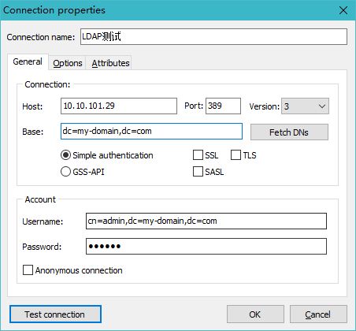
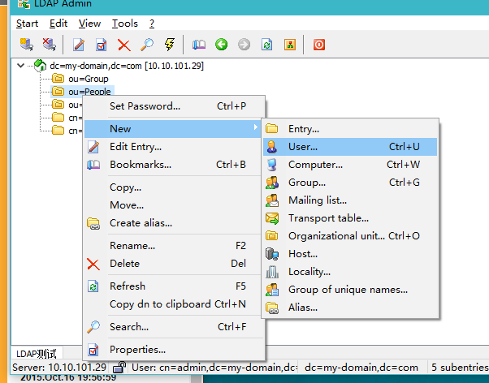

## LDAP介绍

### 目录服务

目录是一个为查询、浏览和搜索而优化的专业分布式数据库，它呈**树状结构组织数据**，就好象Linux/Unix系统中的文件目录一样。目录数据库和关系数据库不同，它有优异的**读性能**，但**写性能差**，并且没有事务处理、回滚等复杂功能，不适于存储修改频繁的数据。所以**目录天生是用来查询的**。LDAP（轻量级的目录访问协议）就为了提供了一个一个管理目录数据的方式。

### 特点

- LDAP的结构用树来表示，而不是用表格。正因为这样，就不能用SQL语句了
- LDAP可以很快地得到查询结果，不过在写方面，就慢得多
- LDAP提供了静态数据的快速查询方式
- Client/server模型，Server 用于存储数据，Client提供操作目录信息树的工具
- 这些工具可以将数据库的内容以文本格式（LDAP 数据交换格式，LDIF）呈现在您的面前
- LDAP是一种开放Internet标准，LDAP协议是跨平台的Interent协议

### LDAP 组织数据的方式

下图为一棵LDAP目录树：


在这棵树中，我们要了解以下几个概念：

#### 条目 Entry

图中每一个发格子就是一个条目Entry，一个条目有若干个属性和若干个值，也可以包含若干个子条目。

#### 识别名Distinguished Name,DN

和Linux的绝对路径相似，表示从目录树根部触发的绝对路径，是条目的唯一标示。图中baby的DN就可以表示为：

```
cn=baby,ou-marketing,ou=people,dc=mydomain,dc=org
```

#### 相对识别名 Relative DN

相对识别名就是DN第一个都好左侧的内容

如baby的RDN就可以表示为

```
cn=baby
```

一般类说，RDN以dc=，ou=，c=，o=的条目为容器，也就是说它们可以包含子条目。

#### 基准识别名 Base DN

指目录的根，本图的DN为：

```
dc=mydomain,dc=org
```

### 属性

每个条目都可以有很多属性（Attribute），比如常见的人都有姓名、地址、电话等属性。每个属性都有名称及对应的值，属性值可以有单个、多个，比如你有多个邮箱。

属性不是随便定义的，需要符合一定的规则，而这个**规则可以通过schema制定**。比如，如果一个entry没有包含在 inetorgperson 这个 schema 中的`objectClass: inetOrgPerson`，那么就不能为它指定employeeNumber属性，因为employeeNumber是在inetOrgPerson中定义的。

LDAP为人员组织机构中常见的对象都设计了属性(比如commonName，surname)。下面有一些常用的别名：

| 属性                   | 别名 | 语法             | 描述             | 值(举例)             |
| ---------------------- | ---- | ---------------- | ---------------- | -------------------- |
| commonName             | cn   | Directory String | 姓名             | sean                 |
| surname                | sn   | Directory String | 姓               | Chow                 |
| organizationalUnitName | ou   | Directory String | 单位（部门）名称 | IT_SECTION           |
| organization           | o    | Directory String | 组织（公司）名称 | example              |
| telephoneNumber        |      | Telephone Number | 电话号码         | 110                  |
| objectClass            |      |                  | 内置属性         | organizationalPerson |

### 对象类

对象类是属性的集合，LDAP预想了很多人员组织机构中常见的对象，并将其封装成对象类。比如人员（person）含有姓（sn）、名（cn）、电话(telephoneNumber)、密码(userPassword)等属性，单位职工(organizationalPerson)是人员(person)的继承类，除了上述属性之外还含有职务（title）、邮政编码（postalCode）、通信地址(postalAddress)等属性。

LDAP对对象的属性也进行了规定，其中有两种属性类型：

+ Must/Required 必须要的基本属性
+ May/Optional 可选的扩展属性

对象类有三种类型：结构类型（Structural）、抽象类型(Abstract)和辅助类型（Auxiliary）。结构类型是最基本的类型，它规定了对象实体的基本属性，每个条目属于且仅属于一个结构型对象类。抽象类型可以是结构类型或其他抽象类型父类，它将对象属性中共性的部分组织在一起，称为其他类的模板，条目不能直接集成抽象型对象类。辅助类型规定了对象实体的扩展属性。每个条目至少有一个结构性对象类。

和面向对象一样，LDAP的对象类可以进行继承多态等操作：


### Schema

对象类（ObjectClass）、属性类型（AttributeType）、语法（Syntax）分别约定了条目、属性、值，他们之间的关系如下图所示。所以这些构成了模式(Schema)——对象类的集合。


### LDAP 文件

LDAP 数据交换格式文件，它以文本形式存储，用于在服务器之间交换数据。添加数据以及修改数据都需要通过 LDIF 文件来进行。可以跟关系型数据库的 SQL 文件做类比。

LDIF 文件的格式一般如下：

```
dn: <识别名>
<属性 1>: <值 1>
<属性 2>: <值 2>
...
```

## 安装

```shell
yum install -y openldap openldap-servers openldap-clients
service slapd start
# 查看状态
netstat -antup | grep -i 389
```

## 设置

运行slappaswwd命令进行生成管理员的密码密文：

```
[root@localhost openldap-2.4.46]# slappasswd
New password:
Re-enter new password:
{SSHA}V66P95ZEFTur6OZYQf10L4h8hlTeUakC
```

首先我们先新建一个modify.ldif格式的文件，输入以下内容：

```
# 修改管理员密码
dn: olcDatabase={2}hdb,cn=config
changetype: modify
add: olcRootPW
olcRootPW: {SSHA}V66P95ZEFTur6OZYQf10L4h8hlTeUakC

# 管理员的DN前缀（一般为Base DN）
dn: olcDatabase={2}hdb,cn=config
changetype: modify
replace: olcSuffix
olcSuffix: dc=my-domain,dc=com

# 管理员的用户名
dn: olcDatabase={2}hdb,cn=config
changetype: modify
replace: olcRootDN
olcRootDN: cn=admin,dc=my-domain,dc=com

dn: olcDatabase={1}monitor,cn=config
changetype: modify
replace: olcAccess
olcAccess: {0}to * by dn.base="gidNumber=0+uidNumber=0,cn=peercred,cn=external, cn=auth" read by dn.base="cn=admin,dc=my-domain,dc=com" read by * none
```

运行如下命令，即可完成对LDAP服务配置的更改：

```shell
ldapadd -Y EXTERNAL -H ldapi:/// -f modify.ldif
```

## 添加节点

下面我们，新建base.ldif添加以下Entry内容：

```
dn: dc=my-domain,dc=com
dc: my-domain
objectClass: top
objectClass: domain

dn: cn=admin,dc=my-domain,dc=com
objectClass: organizationalRole
cn: admin
uid: admin
mail: admin@my-domain.com

dn: cn=testuser,dc=my-domain,dc=com
objectClass: organizationalRole
cn: testuser
uid: testuser
mail: testuser@my-domain.com
description: Just A Test User
```

运行命令插入数据：

```shell
ldapadd -x -W -D "cn=admin,dc=my-domain,dc=com" -f base.ldif
# 检查是否添加成功
ldapsearch -x -b 'dc=my-domain,dc=com' '(objectClass=*)'
```

## 添加用户

P.S.下面出现的测试服务器地址为：10.10.101.29，端口为默认的389，BDN为dc=my-domain,dc=com

用命令的方式效率低下，可以用[LDAP Admin软件](http://www.ldapadmin.org/)进行可视化管理。





可以看到添加的用户信息如下（注意添加userPassword属性，可以通过前面的命令进行生成）：


## LDAP与其它工具的连接

### Redmine中配置

在管理，认证模式中添加如下信息：


点击管理>用户，新建用户，可以将新建的用户通过LDAP添加：


接下来就可以通过LDAP设置的uid和userPassword进行登录这个账号了。

## 参考文献

https://www.itzgeek.com/how-tos/linux/centos-how-tos/step-step-openldap-server-configuration-centos-7-rhel-7.html

http://seanlook.com/2015/01/21/openldap-install-guide-ssl/

https://zhuanlan.zhihu.com/p/32732045

https://segmentfault.com/a/1190000002607140

https://www.cnblogs.com/lemon-le/p/6266921.html

http://www.pfeng.org/archives/564

http://www.pfeng.org/archives/580


