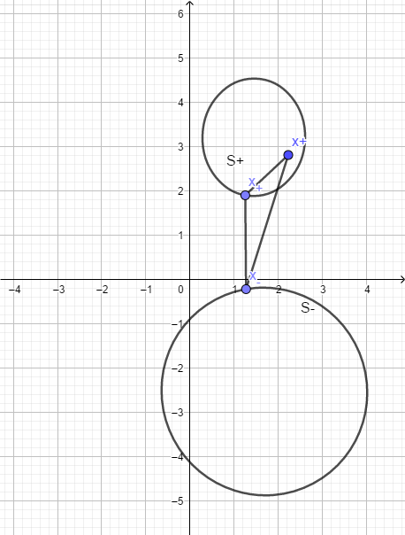

## 2.1

**题目描述：**Minsky和Papert指出：感知机是线性模型，所以不能表示复杂的函数。如异或（XOR），验证感知机为什么不能表示异或。

**解：**异或的输入输出如下：

| $x^{(1)}$ | $x^{(2)}$ | $y$  |
| --------- | --------- | ---- |
| 1         | 1         | -1   |
| 1         | -1        | 1    |
| -1        | 1         | 1    |
| -1        | -1        | -1   |

接下来我们简单证明一下异或操作的线性不可分性：

**证：**利用反证法，假设存在一个超平面$wx+b=0$，满足条件：

$$ y(w\cdot x+b)>0$$

$$\forall x\in{\{(1,1)^{T},(-1,1)^{T},(1,-1)^{T},(-1,-1)^{T}\}}$$

根据异或的输入输出，可以得到以下四个不等式：

$$w^{(1)}+w^{(2)}+b < 0 \dashrightarrow(1)$$
$$w^{(1)}-w^{(2)}+b > 0\dashrightarrow(2)$$
$$-w^{(1)}-w^{(2)}+b < 0 \dashrightarrow(3)$$
$$-w^{(1)}+w^{(2)}+b > 0\dashrightarrow(4)$$

(1)式+(3)式可得：$b<0$，但是(2)式+(4)式可得：$b>0$ 。矛盾，故不存在超平面满足线性可分条件。

## 2.2

**题目描述：**模仿例题 2.1，构建从训练数据求解感知机模型的例子。

**解：**很水的一道题，照样子画葫芦就好。故略。

## 2.3

**题目描述：**证明以下定理：样本集线性可分的充分必要条件是正实例点所构成的凸壳与负实例点所构成的凸壳互不相交。

**凸壳的定义：**设集合$S \in R^{n}$ 是由$R^{n}$ 的k个点所组成的集合，即$S = \{x_{1},x_{2},...,x_{k}\}$。定义S的凸壳$conv(S)$为

$$conv(S)=\{ x= \sum^{k}_{i=1}{\lambda_{i}x_{i}}  | \sum_{i=1}^{k}{\lambda_{i}=1},\lambda_{i}\geq0,i=1,2,...,k     \}$$

**解：** 这个证明对我来说还是太难了(ㄒoㄒ)，最后还是参（shan）考（zhai）了大神的解法。[凸包与线性可分](http://blog.csdn.net/y954877035/article/details/52210734)。

凸壳可以通过以下图形理解：

维基百科上有一句话也非常形象地解释了凸壳：

> 在二维欧几里得空间中，凸包(凸壳)可想象为一条刚好包着所有点的橡皮圈。
>
> From Wiki百科

必要性的证明不难，老老实实从定义出发。不相交很难表述，所以再用反证法就可以了。充分性的证明就难了，难点在与如何通过凸壳不相交构造出一个超平面使得这个超平面满足线性可分性。在这里我们通过“距离”这个定义巧妙地构造出我们需要的超平面。

下面我们开始证明，设数据集T中的正例点集为S+，负实例点集为S-。S+的凸壳为conv(S+)，S-的凸壳为conv(S-)。

**必要性证明：**（线性可分->凸壳不相交）

如果数据集T是线性可分的，则存在超平面将S+和S-完全分离：

我们令$(w\cdot x_i+b)=\epsilon_i \dashrightarrow (1)$ 

那么对于$\forall x_i \in S+$，有$\epsilon_i > 0$，对于$\forall x_i \in S-$，有$\epsilon_i <  0$，

利用反证法，我们假设存在一个点s既属于S+，也属于S-。**（证明关键点）**

S点可以表示为：$s= \sum^{k}_{i=1}{\lambda_{i}x_{i}} \dashrightarrow (2)$，其中 

$$ \sum_{i=1}^{k}{\lambda_{i}=1},\lambda_{i}\geq0,i=1,2,...,k $$

将(1)、(2)联立，可以得到：

$$ws = \sum_{i=1}^{k}{ (\lambda_i\epsilon_i-\lambda_ib )} = \sum_{i=1}^{k}{ \lambda_i\epsilon_i-b }  \dashrightarrow  ws+b =  \sum_{i=1}^{k}{ \lambda_i\epsilon_i } $$

因为$s \in S+$，所以$\epsilon_i>0$，故$w \cdot s+b>0$。同时$s \in S-$，所以$\epsilon_i<0$，故$w\cdot s+b<0$ 。

矛盾，所以不存在一个点s既属于S+，也属于S-。即正例的凸壳和负例的凸壳不相交。**（必要性证毕）**

**充分性证明：**（凸壳不相交->线性可分）

定义空间中两点$x_1$和$x_2$的距离为欧氏距离（向量相减的二范数），记为：$d(x_1,x_2)$，定义凸壳conv(S+)和conv(S-)的距离为：

$$d(conv(S+),conv(S-))=min(d(s_+,s_-)) ,s_+ \in S+,s_- \in S-$$

我们先证明一个引理：

**引理：**我们从S+和S-中分别取出一个点$x_+$和$x_-$，使得他们满足：$d(conv(S+),conv(S-)) = d(x_+,x_-)$。那么对于任意的$x^+ \in S+$，$x^- \in S-$。我们有：

$$d(x^+,x_+) < d(x^+,x_-) ，d(x^-,x_+) > d(x^-,x_-)$$

**引理证明：** 我们只考虑$x^+$的情况，$x^-$的证明留（lan）给（de）读（zheng）者（ming）_(:з」∠)_。为了方便记述，我们令$x=x^+ \in S+$ ，于是有$d(x,x_+) < d(x,x_-) $ 。

**(引理证毕)**

回到充分性的证明上来。我们现在构造一个超平面$w\cdot x+b=0$，其中：

$$w=2(x_+-x_-)$$

$$b=x^2_--x^2_+$$

对于所有正例点$x^+$，有：

$$w\cdot x^+ +b = d(x_-,x^+)^2-d(x_+,x^+)^2>0$$

同样对于所有负例点：

$$w\cdot x^-+b <0$$

故该超平面满足线性可分性**（充分性证毕）**

**PS：** 充分性借鉴了凸优化的相关理论。关于凸优化相关知识可以参考知乎上的回答：[为什么凸优化这么重要？ - Ormsom的回答 - 知乎](https://www.zhihu.com/question/24641575/answer/164397294)。充分性证明也有采用凸集分离定理，这里不作阐述。

## 参考资料

[凸包与线性可分](http://blog.csdn.net/y954877035/article/details/52210734)

[李航第二章课后习题](http://blog.csdn.net/xiaoxiao_wen/article/details/54097835)

